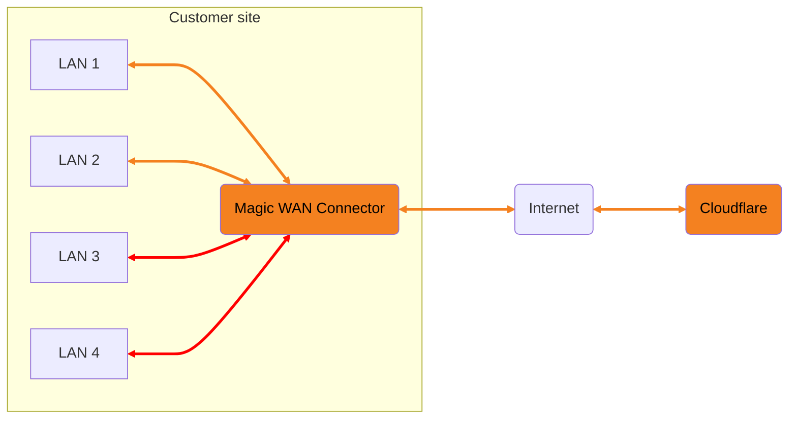

import { Render, TabItem, Tabs } from "~/components";

You can define policies in your Connector to either allow traffic to flow between your LANs without it leaving your local premises or to forward it via the Cloudflare network where you can add additional security features. The default behavior is to drop all LAN-to-LAN traffic. These policies can be created for specific subnets, and link two LANs.



_In the above example, the red path shows traffic that stays in the customer's premises (allowing direct communication between LAN 3 and LAN 4), and the orange path shows traffic that goes to Cloudflare before returning to the customer's premises (processing traffic between LAN 1 and LAN 2 in Cloudflare)._

<br />

As a best practice for security, we recommend sending all traffic through Cloudflare’s network for Zero Trust security filtering. Use these policies with care and only for scenarios where you have a hard requirement for LAN-to-LAN traffic flows.

If you enable LAN to LAN traffic flows, communications can only be initiated from origin to destination — for example, LAN 1 to LAN 2 — and not the other way around. This is by design and prevents potential exfiltration of information. This does not mean bidirectional communication on TCP is not possible. It only means that the origin is the only one authorized to initiate communications.

Unidirectional communication can be enabled for UDP and ICMP, but it is not available for TCP, as it would break that protocol.

The following guide assumes you have already created a site and configured your Connector. To learn how to create a site and configure your Connector, refer to [Configure hardware Connector](/magic-wan/configuration/connector/configure-hardware-connector/) or [Configure virtual connector](/magic-wan/configuration/connector/configure-virtual-connector/), depending on the type of Magic WAN Connector you have on your premises.

## Create a policy

<Tabs syncKey="dashPlusAPI"> <TabItem label="Dashboard">

Follow the steps below to create a new LAN policy to segment your network. Only the fields marked **required** are mandatory.

1. Log in to the [Cloudflare dashboard](https://dash.cloudflare.com/login), and select your account.
2. Select **Magic WAN** > **Connector on-ramps (beta)**.
3. Select the Connector you want to configure > **Edit**.
4. Go to **Network Configuration**, and scroll down to **LAN configuration**.
5. Select **LAN policies** > **Create Policy**.
6. In **Policy name**, enter a descriptive name for the policy you are creating.
7. From the drop-down menu **Origin (required)**, select your origin LAN.
8. Specify a subnet for your first LAN in **Subnets**.
9. In **Ports** specify the TCP/UDP ports you want to use. Valid ports range from `1` to `65535`. Zero (`0`) is not a valid port number. Add a comma to separate each of the ports or add a port range. For example, `2,5,6,9-14`.
10. In **Destination (required)**, select the destination LAN and repeat the above process to configure it.
11. In **Protocols**, select the type of traffic you want to allow. You can choose **TCP**, **UDP**, and **ICMP**. You can also select **Any** to choose all types of traffic.
12. In **Traffic direction** you can choose between bidirectional traffic (the default) and unidirectional traffic. What you can choose depends on the protocol that you chose for the policy:
	1. **Any**: If **Any** is selected and you choose **Unidirectional**, the system will alert you that this will break TCP traffic.
	2. **TCP**: You can only select **Bidirectional**.
	3. **UDP**: The system defaults to **Bidirectional** but you can choose **Unidirectional**.
	4. **ICMP**: The system defaults to **Bidirectional** but you can choose **Unidirectional**.
13. In **Traffic path**, select **Forwarded via Cloudflare** if you want traffic to be forwarded to Cloudflare to be processed. If you do not select this option, traffic will flow locally, in your premises without passing through Cloudflare.
14. Select **Create policy**.

The new policy will ensure that traffic between the specified LANs flows locally, bypassing Cloudflare.

</TabItem> <TabItem label="API">

<Render file="connector/account-id-api-key" />

Create a `POST` request [using the API](/api/operations/magic-site-acls-create-acl) to create a network policy.

Example:

```bash
curl https://api.cloudflare.com/client/v4/accounts/{account_id}/magic/sites/{site_id}/acls \
--header "X-Auth-Email: <EMAIL>" \
--header "X-Auth-Key: <API_KEY>" \
--header "Content-Type: application/json" \
--data '{
  "acl": {
    "description": "<POLICY_DESCRIPTION>",
    "forward_locally": true,
    "lan_1": {
      "lan_id": "<LAN_ID>",
      "lan_name": "<LAN_NAME>",
      "ports": [
        1
      ],
      "subnets": [
        "192.0.2.1"
      ]
    },
    "lan_2": {
      "lan_id": "<LAN_ID>",
      "lan_name": "<LAN_NAME",
      "ports": [
        1
      ],
      "subnets": [
        "192.0.2.1"
      ]
    },
    "name": "<POLICY_NAME>",
    "protocols": [
      "tcp"
    ]
  }
}'
```

```json output
{
	"errors": [],
	"messages": [],
	"result": {
		"acls": [
			{
				"description": "<POLICY_DESCRIPTION>",
				"forward_locally": true,
				"id": "023e105f4ecef8ad9ca31a8372d0c353",
				"lan_1": {
					"lan_id": "<LAN_ID>",
					"lan_name": "<LAN_NAME>",
					"ports": [1],
					"subnets": ["192.0.2.1"]
				},
				"lan_2": {
					"lan_id": "<LAN_ID>",
					"lan_name": "<LAN_NAME>",
					"ports": [1],
					"subnets": ["192.0.2.1"]
				},
				"name": "<POLICY_NAME>",
				"protocols": ["tcp"]
			}
		]
	},
	"success": true
}
```

Take note of the `id` parameter, as you will need it to edit or delete network policies.

</TabItem> </Tabs>

The new policy will ensure that traffic between the specified LANs flows locally, bypassing Cloudflare.

## Edit a policy

<Tabs syncKey="dashPlusAPI"> <TabItem label="Dashboard">

1. Log in to the [Cloudflare dashboard](https://dash.cloudflare.com/login), and select your account.
2. Select **Magic WAN** > **Connector on-ramps (beta)**.
3. Select the Connector you want to configure > **Edit**.
4. Go to **Network Configuration**, and scroll down to **LAN configuration**.
5. Select **LAN policies**.
6. Select the policy you need to edit > **Edit**.
7. Make your changes, and select **Update policy**.

</TabItem> <TabItem label="API">

<Render file="connector/account-id-api-key" />

Create a `PUT` request [using the API](/api/operations/magic-site-acls-update-acl) to edit a network policy.

Example:

```bash
curl --request PUT \
https://api.cloudflare.com/client/v4/accounts/{account_id}/magic/sites/{site_id}/acls/{acl_id} \
--header "X-Auth-Email: <EMAIL>" \
--header "X-Auth-Key: <API_KEY>" \
--header "Content-Type: application/json" \
--data '{
  "acl": {
    "description": "<POLICY_DESCRIPTION>",
    "forward_locally": true,
    "lan_1": {
      "lan_id": "<LAN_ID>",
      "lan_name": "<LAN_NAME>",
      "ports": [
        1
      ],
      "subnets": [
        "192.0.2.1"
      ]
    },
    "lan_2": {
      "lan_id": "<LAN_ID>",
      "lan_name": "<LAN_NAME>",
      "ports": [
        1
      ],
      "subnets": [
        "192.0.2.1"
      ]
    },
    "name": "<POLICY_NAME>",
    "protocols": [
      "tcp"
    ]
  }
}'
```

</TabItem> </Tabs>

## Delete a policy

<Tabs syncKey="dashPlusAPI"> <TabItem label="Dashboard">

1. Log in to the [Cloudflare dashboard](https://dash.cloudflare.com/login), and select your account.
2. Select **Magic WAN** > **Connector on-ramps (beta)**.
3. Select the Connector you want to configure > **Edit**.
4. Go to **Network Configuration**, and scroll down to **LAN configuration**.
5. Select **LAN policies**.
6. Select the policy you need to edit > **Edit**.
7. Select **Delete**.
8. Select **I understand that deleting a policy is permanent** in the dialog box > **Delete**.

</TabItem> <TabItem label="API">

<Render file="connector/account-id-api-key" />

Create a `DELETE` request [using the API](/api/operations/magic-site-acls-delete-acl) to delete a network policy.

Example:

```bash
curl --request DELETE \
https://api.cloudflare.com/client/v4/accounts/{account_id}/magic/sites/{site_id}/acls/{acl_identifier} \
--header "X-Auth-Email: <EMAIL>" \
--header "X-Auth-Key: <API_KEY>"
```

</TabItem> </Tabs>
